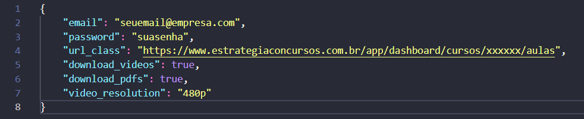

# Automação Web Estratégia Concursos

Projeto para automatizar o download de vídeo aulas e PDFs dos cursos do site [Estratégia Concursos](https://www.estrategiaconcursos.com.br/).

## Requisitos
- Python 3+
- Sistema Windows

## Instalação pelo CMD (pelo git)
```bash
git clone https://github.com/gabrielmatos0/estrategia-concursos-autod.git
cd estrategia-concursos-autod
py -m venv venv 
venv\scripts\activate 
pip install -r requirements.txt # baixe as dependências do projeto
py main.py
```

# Configuração de downloads
A configuração será feita pelo arquivo ```config.json``` para 
- [x] Editar seu login do estratégia (email e senha)
- [x] Mudar o link da aula que quiser baixar
- [x] Poder baixar vídeos e PDFs, somente vídeos ou só PDFs
- [x] Escolher a resolução dos vídeos (360p 480p, 720p)



> **OBS**: o arquivo ```config-example.json``` serve de exemplo para mostrar a estrutura do json, **crie um arquivo chamado ```config.json``` e rode o ```main.py```**
